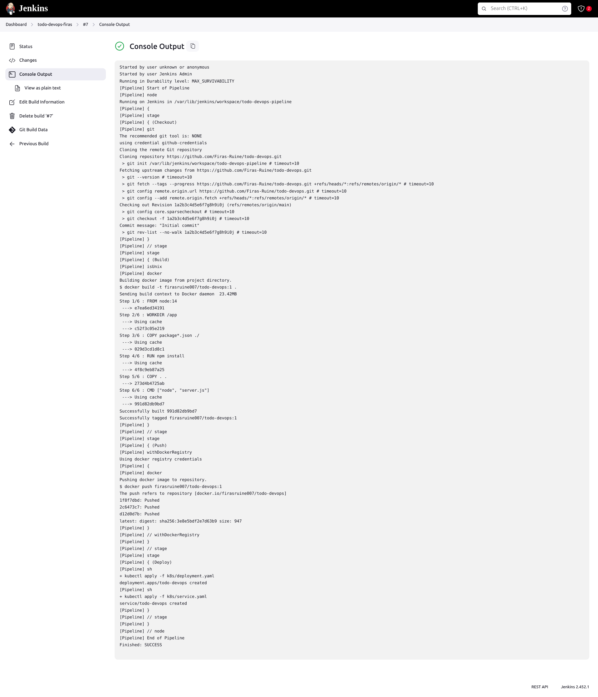

# Jenkins Pipeline (Jenkinsfile)
The Jenkins pipeline is defined in a Jenkinsfile, which automates the process of building, pushing, and deploying the application. Below is an explanation of each stage in the pipeline:

## Stages Checkout

This stage checks out the code from the Git repository.
The repository URL is https://github.com/Firas-Ruine/todo-devops.git and it checks out the main branch.

```groovy
stage('Checkout') {
    steps {
        git branch: 'main', url: 'https://github.com/Firas-Ruine/todo-devops.git'
    }
}
```

## Build

This stage builds the Docker image for the application.
The Docker image is tagged with the build number of the Jenkins job.
```groovy
stage('Build') {
    steps {
        docker.build("firasruine007/todo-devops:${env.BUILD_NUMBER}")
    }
}
```

## Push

This stage pushes the built Docker image to Docker Hub.
The image is pushed using the credentials stored in Jenkins.
```groovy
stage('Push') {
    steps {
        docker.withRegistry('https://registry.hub.docker.com', 'docker-hub-credentials') {
            docker.image("firasruine007/todo-devops:${env.BUILD_NUMBER}").push()
        }
    }
}
```

## Deploy

This stage deploys the application to a Kubernetes cluster.
The deployment is managed using Kubernetes manifests located in the k8s directory.

```groovy
stage('Deploy') {
    steps {
        sh 'kubectl apply -f k8s/deployment.yaml'
        sh 'kubectl apply -f k8s/service.yaml'
    }
}
```

The deployment to Kubernetes is managed using the manifests in the k8s directory. These manifests define the deployment and service configurations for the application. The Jenkins pipeline applies these manifests to deploy the application.


You find the build screenshot here : 
